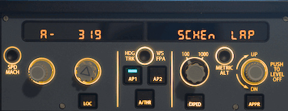
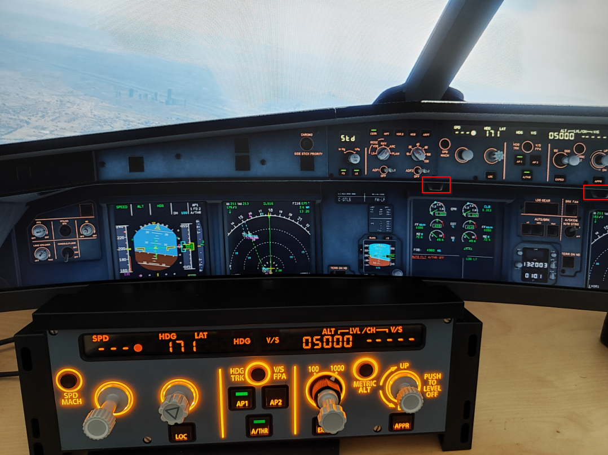

# XSchenFly
Use winwing mcdu / fcu / efis-l / efis-r on Linuc and Mac for X-Plane Toliss Airbus.

## Status

All buttons, leds and lcd displays work the same way as in X-Plane. 
Tested with:
 * XP12 under linux (debian trixie)
 * XP11 under linux (debian bookworm)
 * XP12 under MacOs (Sequoia 15.0.1)
 * Toliss A319, A320Neo, A321Neo, A339, A340-600

Supported Hardware:
 * Rowsfire A107: work in progress (awaiting shipment)
 * Winwing MCDU: fully supported
 * Winwing FCU: fully supported
 * Winwing EFIS-R: fully supported
 * Winwing EFIS-L: fully supported
 * Wingflex RMP: is on todo list

Change brightness with the two brightness knobs in the cockpit.

For Discussions use https://forums.x-plane.org/forums/topic/324813-winwing-mcdu-on-x-plane-for-mac-studio-and-linux/

## Installation

#### Debian based system
1. clone the repo where you want
2. copy `udev/71-winwing.rules` to `/etc/udev/rules.d`  
`sudo cp udev/71-winwing.rules /etc/udev/rules.d/`
3. install dependencies (on debian based systems)  
`sudo aptitide install python3-hid python3-serial libhidapi-hidraw0 python3-websockets`
5. start script (with udev rule no sudo needed): `python3 ./XSchenFly.py` when X-Plane with Toliss aircraft is loaded.

#### MAC-OS

1. clone the repo where you want
2. change into the directory `cd XSchenFly`
3. install homebrew
4. install dependencies
`python3 -m pip install hid`
`python3 -m pip install requests`
`python3 -m pip install websockets`
5. brew install hidapi
6. let hid find hidapi: `ln -s /opt/homebrew/lib/libhidapi.dylib .`
7. start script with: `python3 ./XSchenFly.py` when X-Plane with Toliss aircraft is loaded.

## Use
1. start X-Plane
2. enable incoming traffic in settings / network (at the very bottom of the page)
3. load Toliss A319
4. start script as written above
5. enjoy flying (and report bugs :-)  )

## developer documentation
See [documention](./documentation/README.md) for developers. TODO

## Notes
Use at your own risk. Updates to the winwing devices can make the script incompatible.
TODO: The data sent in the USB protocol by SimApp Pro has not yet been fully implemented, only to the extent that it currently works.

## Next steps
 * bring all devices to websockets communication

## Contact
<memo_5_@gmx.at> (without the two underscores!) or as pm in https://forums.x-plane.org, user memo5.

## Sponsoring
To sponsor you can 
[http://buymeacoffee.com/schenlap](http://buymeacoffee.com/schenlap)
